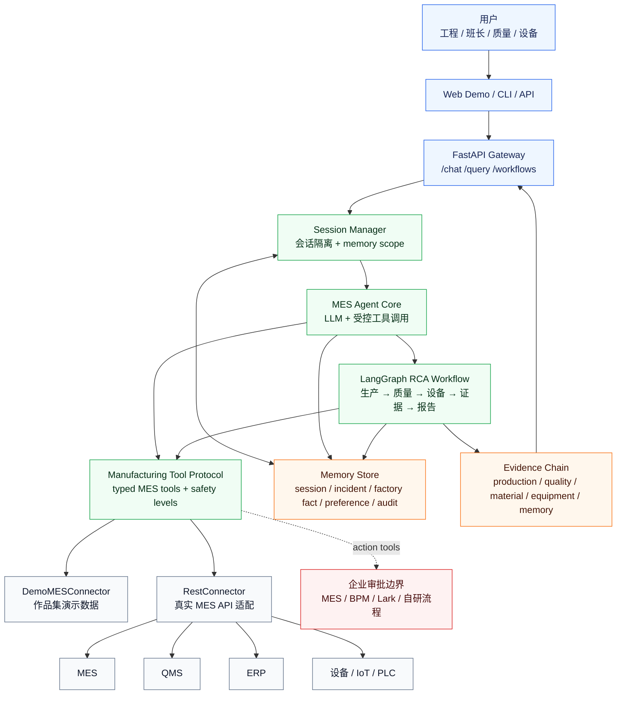
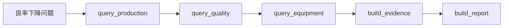

# ManuGent 架构介绍图

这张图用于在 README、作品集或技术介绍中快速说明 ManuGent 的整体架构。

## 如何讲解这张图

ManuGent 位于“人”和“工厂系统”之间。用户通过 Web、CLI 或 API 发起问题，
API 创建隔离会话，然后由 MES Agent 通过受控工具调用回答问题，或者进入
LangGraph 根因分析 workflow。

Agent 不直接访问任意数据库，而是通过 Manufacturing Tool Protocol 调用
typed MES tools。工具协议定义了参数、返回结构、安全级别和连接器边界，
这样更容易审计，也更适合接入已有 MES、QMS、ERP 和设备系统。

Memory 是架构中的一等能力。会话历史、历史异常、工厂事实、用户偏好和
审计事件被拆开管理，避免不同用户、不同工厂、不同场景的上下文混在一起。

审批被画成外部边界是刻意设计。ManuGent 可以识别哪些 action tool 跨过
安全边界，但真正的审批路由、超时、升级、代办、执行权限，通常属于 MES、
BPM、Lark/飞书或企业自研流程平台。

## RCA LangGraph 细节

当前实现的 LangGraph workflow 是线性的。这不是缺点，而是为了先把制造业分析
路径显式化：先查生产，再查质量，再查设备，然后构造证据链并生成报告。
后续可以继续扩展成条件路由、失败重试、多 Agent supervisor 等模式。
